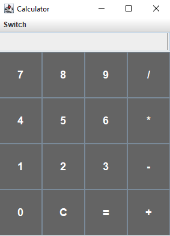
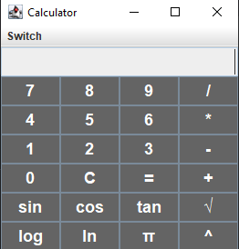

# CalculatorGUI

A simple calculator developed in Java with a graphical interface using `Swing`. The calculator has functions such as adding, subtracting, multiplying, dividing, calculating square roots and exponentiation.

## Features

- **Mathematical operations**: Addition, subtraction, multiplication, division, exponentiation.
- **Scientific calculator function**: After clicking on the “Switch” and “Toggle Scientific Mode” switches to the scientific calculator
- **Square root**: Calculates the square root of positive numbers.
- **Modern design**: Graphical interface with an intuitive layout.

<br/>

## How to use

1. Download or clone this repository.
2. Open the project in an IDE such as IntelliJ IDEA, Eclipse or NetBeans.
3. Compile and run the `Main.java` file.

## How to run

### Pre-requisites

Make sure you have [Java](https://www.oracle.com/java/technologies/javase-jdk11-downloads.html) installed on your machine.

To compile and run the program in the terminal, use the following commands:

```bash
javac Main.java # Compile
java Main # Run
